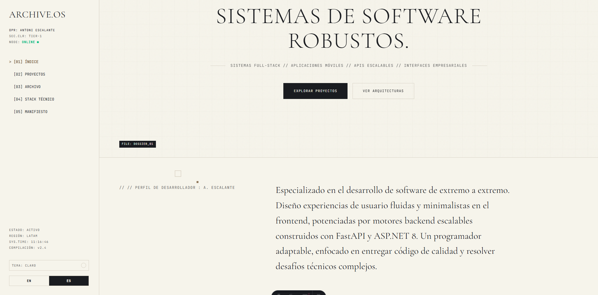
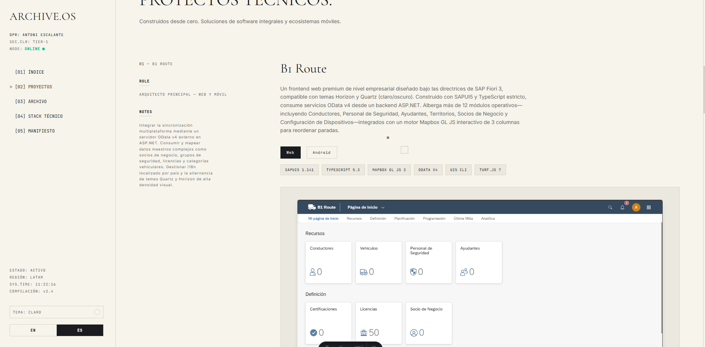
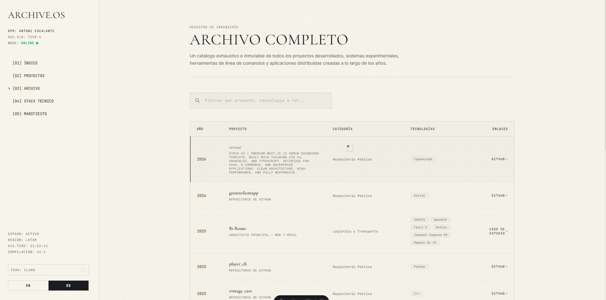
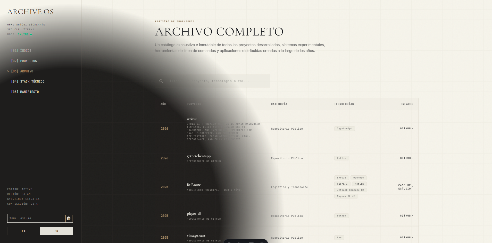

# Archive.OS // Personal Portfolio

[](https://astro.build)
[](https://reactjs.org)
[](https://tailwindcss.com)
[](https://opensource.org/licenses/MIT)

A premium, minimal, cyber-dashboard inspired personal portfolio built for **Antoni Escalante // Software Engineer**. Framed as an interactive command-line operational system interface, it documents engineering records, system architectures, and mobile app developments.

**Live Demo:** [aescalante.dev](https://aescalante.dev)

---

## Screenshot Gallery

Here is a visual overview of **Archive.OS** in action:

| **01 // Main System Dashboard** | **02 // Developer Profile & Details** |
|:---:|:---:|
|  |  |
| **03 // Dynamic Repo Archive** | **04 // Tech Stack & Architecture** |
|  |  |

---

## Key Features

- **Cyber-Terminal Aesthetics**: Monospaced typography, clean structural borders, and modular status grids.
- **Dynamic Active Route Tracking**: An `IntersectionObserver` updates the sidebar in real-time, showing a terminal caret (`>`) pointing to the active section as you scroll.
- **High-Performance Custom Cursor**: A custom-designed, lag-free cursor that morphs into terminal selection brackets `[ ]` over interactive elements and a vertical text caret `|` over text fields, optimized with direct DOM manipulation.
- **Live System Clock & Pulsing Node Status**: Real-time clock updating every second and a pulsing green light beacon to signify the system's "online" status.
- **Dynamic Repository Explorer**: A dynamic `/archive` directory that pulls live public repository data from the GitHub API using an infinite-scroll layout with duplicate filtering.
- **Bilingual Interface**: Seamless hot-swapping between English and Spanish translation models.

---

## Technology Stack

- **Core Framework**: [Astro](https://astro.build) (Static Site Generation for lightning-fast loads)
- **UI Libraries**: [React](https://react.org) (Interactive widgets, state management)
- **Styling**: [Tailwind CSS 4](https://tailwindcss.com) (Modern utility styling and design tokens)
- **Icons**: Custom SVGs & styled typography
- **Data Integrations**: GitHub REST API (dynamic repository loading)

---

## Setup & Local Development

To run this project locally, ensure you have [Node.js](https://nodejs.org) and [pnpm](https://pnpm.io) installed.

### 1. Clone the repository
```bash
git clone https://github.com/AnthonyXJ99/mi-portafolio.git
cd mi-portafolio
```

### 2. Install dependencies
```bash
pnpm install
```

### 3. Run the development server
```bash
pnpm dev
```
The server will boot at `http://localhost:4321` (or next available port).

### 4. Build for Production
To generate a static build, compile the project using:
```bash
pnpm build
```
This produces optimized production assets inside the `/dist` directory, ready to be deployed to any static host (Netlify, Vercel, GitHub Pages, or Cloudflare Pages).

---

## Project Structure

```text
mi-portafolio/
├── .github/
│   └── assets/             # Repository screenshots and icons
├── public/                 # Static assets (images, mockups, favicons)
│   └── images/
│       ├── appsarcons/     # Cover image for Play Store applications
│       ├── b1route/        # B1 Route application showcases
│       └── strixui/        # StrixUI component layouts
├── src/
│   ├── components/
│   │   └── portfolio/      # Core React UI components
│   │   │   ├── archive/    # Archive directory pages & APIs
│   │   │   ├── home/       # Hero, profile, works, and tech stacks
│   │   │   ├── layout/     # Sidebar, footer, ambient background, custom cursor
│   │   │   └── context/    # Portfolio Context (theme, language, state)
│   ├── layouts/
│   │   └── Layout.astro    # Global HTML wrapper
│   ├── pages/
│   │   ├── index.astro     # Main portfolio dashboard route
│   │   ├── archive.astro   # Deep archive table route
│   │   └── blog/           # Manifesto / technical articles
│   └── styles/
│       └── global.css      # Core styles & Tailwind imports
├── package.json
└── tsconfig.json
```

---

## License

Distributed under the MIT License. See [LICENSE](LICENSE) for more information.

Developed by **[Antoni Escalante](https://linkedin.com/in/antoni-escalante)**.
